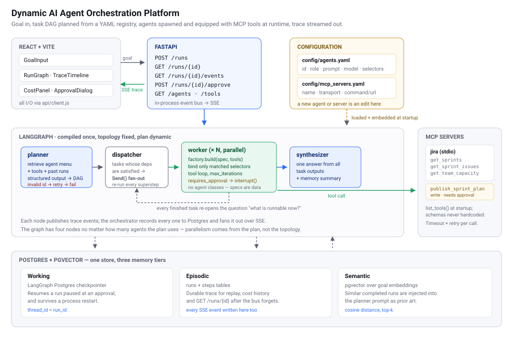
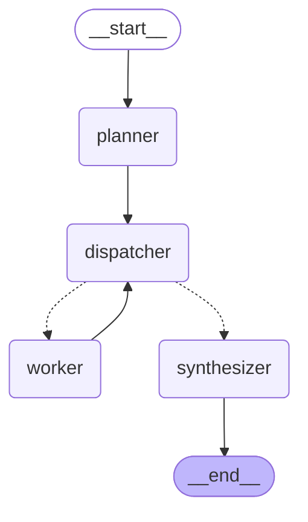

# Dynamic AI Agent Orchestration Platform

Submit a natural-language goal. The platform **designs the specialist agents for it
at runtime** — writing each agent's name, role and system prompt, and choosing its
tools — inside permission envelopes declared in YAML, runs them as a DAG, and
returns a synthesized answer with a full execution trace.

> **"Predict the velocity for our next sprint based on previous Jira sprints."**
>
> → the planner creates a `velocity_forecaster` agent under the `jira_reporting`
> envelope, writes it a five-step method ("call `jira.get_sprints`… show the
> arithmetic explicitly… only call it a trend if the movement is sustained"),
> grants it the two read tools it asked for, and streams the run to the browser.

**No agent's prompt exists as a fixed string in this repository.** There is no
`JiraAgent` class and no agent record in YAML. `agents.yaml` declares *capabilities*
— what a class of agent may touch and the policy it must obey — and the planner
writes the agent. A generated agent can narrow its envelope, never widen it, which
is what keeps the approval gate and the tool permissions meaningful.



Full design rationale: **[docs/architecture.md](docs/architecture.md)**.

New to the codebase? **[docs/codebase-guide.pdf](docs/codebase-guide.pdf)** traces one real
request from the browser to the answer, explains every module, and assumes no prior knowledge
of MCP, LangGraph or embeddings.

---

## Quick start

### With Docker (recommended)

```bash
cp .env.example .env
# Put a real key in ANTHROPIC_API_KEY — everything else has working defaults.
# OPENAI_API_KEY is optional and used only for embeddings; without it retrieval
# falls back to a local lexical embedder that matches words rather than meaning.

docker compose up --build
```

`.env` is passed wholesale to the backend container, so **any setting you add
there reaches the app without editing `docker-compose.yml`**. Two deliberate
exceptions: `DATABASE_URL` is overridden to `postgres:5432` (a localhost URL
would point the container at itself), and the database and frontend containers
get only the two or three values they need rather than the API key. The file is
optional — with no `.env`, everything falls back to the defaults in
`backend/app/settings.py`.

| | |
|---|---|
| UI | http://localhost:5173 |
| API docs (Swagger) | http://localhost:8000/docs |
| Health | http://localhost:8000/health |

The mock Jira MCP server runs as a stdio subprocess of the backend container, so
there is no fourth service to start.

### Without Docker

```bash
docker compose up -d postgres          # Postgres + pgvector, published on 5433

python3.12 -m venv .venv && source .venv/bin/activate
pip install -e "backend[dev]"
cp .env.example .env                   # DATABASE_URL already points at localhost:5433

cd backend && uvicorn app.main:app --reload    # :8000
cd frontend && npm install && npm run dev      # :5173
```

Postgres is published on **5433**, not 5432, so it cannot collide with a Postgres
you may already be running.

### Running the tests

Tests stub the LLM and **need no API key**. They start the real mock MCP server
over stdio, so tool discovery and invocation are genuinely exercised.

```bash
cd backend && pytest          # 81 tests, ~12s
docker compose exec backend pytest      # or inside the container
```

---

## Demonstration scenarios

Each is a one-click example in the UI.

| # | Prompt | What it demonstrates |
|---|---|---|
| 1 | *Predict the velocity for our next sprint based on previous Jira sprints.* | The core scenario: multi-agent plan, MCP tool use, synthesis |
| 2 | *How many story points did we complete in the last three sprints, and what was our completion rate?* | **Small goals get small plans** — one agent, not four |
| 3 | *Two independent things about our next sprint: a velocity forecast from sprint history, and the team capacity available. Then review the combined picture for delivery risk.* | **Parallel fan-out** — the forecast and capacity tasks are dispatched in one superstep, then converge on the reviewer |
| 4 | *Work out our next sprint commitment and publish it to the Jira board.* | **Human approval** — the run pauses before the write tool and waits for you |

Scenario 3 is worth watching in the trace: both branches report `task.started`
before either one's tool call returns. Phrasing matters — ask instead to
*"forecast velocity and **adjust it** for availability"* and the planner correctly
produces a sequential chain, because the second task then genuinely depends on the
first. The plan is a real decision, not a fixed pipeline.

Scenario 4 is the one to try deliberately: `jira_writeback` is the only envelope
that can write to Jira, and it is marked `requires_approval: true`. The graph
interrupts *before* the agent runs and checkpoints to Postgres. The approval dialog
shows **the generated prompt that is about to run**, since that is what you are
actually approving. Decline it and the write never happens; the run still completes
and says what was skipped.

### Watching agents get created

Run the same goal twice and compare `plan[].agent.system_prompt` in
`GET /runs/{id}` — the agents are written fresh each time. Then edit
`backend/config/agents.yaml` and watch the envelope constrain them: narrow
`jira_reporting`'s `allowed_tool_selectors` to just `jira.get_sprints` and the
next run's agent can no longer ask for issue-level data, however it is prompted.
The "Registry" panel in the UI shows the envelopes the planner is designing against.

---

## API

Interactive docs and the OpenAPI schema are generated at **`/docs`** and
`/openapi.json`.

| Method | Path | Purpose |
|---|---|---|
| `POST` | `/runs` | Submit a goal; returns `run_id` immediately (202) |
| `GET` | `/runs/{id}` | Final state, plan, answer, cost and durable trace |
| `GET` | `/runs/{id}/events` | SSE trace stream |
| `POST` | `/runs/{id}/approve` | Resume an interrupted run |
| `GET` | `/agents` | The loaded capability registry, ceilings resolved to real tools |
| `GET` | `/tools` | Tools discovered from MCP servers at startup |

```bash
RUN=$(curl -s -X POST localhost:8000/runs -H 'content-type: application/json' \
  -d '{"goal":"Predict the velocity for our next sprint."}' | jq -r .run_id)

curl -N localhost:8000/runs/$RUN/events      # live trace
curl -s localhost:8000/runs/$RUN | jq        # final state
```

The SSE stream **replays everything already published** before going live, so
attaching after `POST /runs` — or after the run has already finished — still
renders the full trace.

---

## Adding a capability (the whole point)

You do not add agents — the planner writes those. You add an *envelope*: a new
class of thing agents are allowed to do. Append to `backend/config/agents.yaml`
and restart. No Python.

```yaml
  - id: release_communication
    description: >-
      Drafts release notes and changelogs from the issues completed in a sprint,
      grouped by change type and written for a non-technical audience.
    allowed_tool_selectors: ["jira.get_sprint_issues"]
    allowed_models: ["claude-sonnet-5", "claude-haiku-4-5"]
    default_model: claude-sonnet-5
    max_iterations_limit: 4
    requires_approval: false
    policy: |
      Never describe work that is not in the issue list you were given.
```

Note what is **not** there: no `system_prompt`. Putting one in is rejected at
startup — that is the thing this design removed.

`description` is embedded and matched against the user's goal, so **write it as a
description of capability using the words a user would use**. This is not
cosmetic: an early version of the velocity envelope ranked poorly for velocity
goals because its text never contained the word "velocity".

`policy` is the escape hatch for a rule that must hold no matter what the planner
writes. It is appended *after* the generated prompt under an explicit override
header, because later instructions carry more weight than earlier ones.

Adding an integration is the same kind of edit to
[`backend/config/mcp_servers.yaml`](backend/config/mcp_servers.yaml).

---

## Technology choices

| Choice | Why |
|---|---|
| **FastAPI** | Async, native SSE, and OpenAPI docs for free — a required deliverable |
| **LangGraph** | `Send` for runtime fan-out, `interrupt()` for durable human approval, Postgres checkpointing. Used for the runtime only — no prebuilt agents |
| **LangChain** | Only `langchain-mcp-adapters` and `ChatAnthropic`. No chains, no agents, no memory |
| **Postgres + pgvector** | One store for all three memory tiers. A second datastore would need to earn its place |
| **React + Vite** | Fast dev server, no framework overhead |
| **React Flow** | Renders the run DAG without hand-drawn SVG |
| **Claude** | `claude-opus-5` plans and synthesizes; workers run `claude-sonnet-5`. Each capability declares the models it permits, and the planner picks one from that list |

**Not used, deliberately:**

- **LangFlow** — its flow definition lives in GUI state, which contradicts the
  premise that routing is version-controlled configuration decided at runtime.
- **Redis** — a single API process has one publisher and a few SSE subscribers.
  There is nothing for a broker to do, and the durable trace is in Postgres.

---

## How it works, briefly

1. **Startup** loads `agents.yaml` (embedding each capability `description`), opens
   a session to every server in `mcp_servers.yaml` and calls `list_tools()`,
   prepares Postgres, and compiles the graph. Tool schemas are never hardcoded.
2. **Planning** embeds the goal, retrieves a menu of candidate capabilities,
   relevant tools and similar past runs, then makes one structured-output call that
   **designs an agent per task** — name, role, system prompt, tools. Two checks
   follow: `capability_id` against the registry, then every synthesized agent is
   dry-run through the envelope. Either failure is retried once with the error fed
   back, then fails the run. Checking here means an escalation costs a retry rather
   than a half-finished run.
3. **Execution** dispatches every task whose dependencies are satisfied, in
   parallel, via LangGraph `Send`. The graph has four nodes no matter how many
   agents run; parallelism comes from the plan.
4. **Each worker** realizes its agent against the envelope again — the worker does
   not trust the plan it was handed — appends the capability's policy to the
   generated prompt, binds only the tools that were granted, runs a tool loop
   bounded by `max_iterations`, and emits a trace event per tool call.
5. **Synthesis** produces the answer plus a summary that is embedded for future
   planning.

### The compiled graph

The whole topology, whatever the plan turns out to be:



The dotted edges out of `dispatcher` are the conditional ones — that is the scheduler,
and it is the only reason a plan of any shape runs with the right parallelism.
`worker → dispatcher` is a genuine cycle: each finished task re-opens the question of
what is runnable now. See
[architecture.md §3](docs/architecture.md#3-langgraph-and-langchain--what-each-is-actually-used-for).

---

## Assumptions

- **Jira is mocked.** No credentials were available, so
  `mcp_servers/jira_mock/` serves fixture data over real MCP/stdio. Swapping in a
  real server is a config edit; see the commented block in `mcp_servers.yaml`.
- **A rolling average is the forecast.** The forecasting agent computes a mean of
  recent completed points and says that is what it is. A real forecasting model is
  out of scope, and dressing a mean up as one would be worse than saying so.
- **Single tenant, single process.** No auth, one shared set of MCP sessions.
- **The demo fixture is synthetic** — eight closed sprints with plausible
  committed/completed spreads.

## Known limitations

- **Generated prompts vary between runs.** This is the direct cost of creating
  agents at runtime: the same goal can produce differently-worded agents, so
  output is less repeatable than a hand-tuned prompt would be, and a bad
  generation is possible. Two things bound it — the capability `policy` carries
  the rules that must hold regardless of wording, and every run records the exact
  prompt that ran in `plan[].agent.system_prompt` and in the `task.started` event,
  so any run can be audited or reproduced after the fact. Pinning a known-good
  generated prompt per capability would be the next step if determinism mattered
  more than adaptability.
- **Planning costs more than it used to.** The planner writes prompts now, so it
  emits far more output tokens per plan than when it only picked ids.
- **The live event bus is in-process.** It does not fan out across replicas and
  does not survive a restart. The durable trace in `steps` does, and
  `GET /runs/{id}` serves it.
- **Retrieval degrades without an OpenAI key.** Embeddings come from
  `text-embedding-3-small`; with no key configured the platform falls back to a local
  lexical vectorizer that matches shared words rather than meaning. On paraphrased goals
  that costs real accuracy — measured over a set of reworded queries, top-1 retrieval is
  **5/6 hosted against 3/6 on the fallback**. Everything still runs; it just retrieves
  worse. See [architecture.md §5](docs/architecture.md#5-memory-design-and-persistence).
- **A capability's `description` is retrieval surface.** A description written about
  *mechanism* rather than *capability* retrieves badly whatever the model: rewording one
  of the four moved its score for a matching goal from 0.25 to 0.53.
- **Changing the embedding model invalidates stored vectors.** They live in a different
  space, so past runs rank arbitrarily until re-run. Nothing crashes if the width matches.
  `docker compose down -v` clears them.
- **No authentication**, and any caller can approve a paused run.
- **Schema is created with `create_all`** at boot, not migrations.
- **Planner quality is untested.** There is no eval set scoring whether the planner
  picks the right capabilities or writes good prompts; the tests pin the *contract*
  (it cannot invent an id, it cannot escape an envelope, it cannot emit a cycle),
  not the judgement. Prompt quality is now part of what the planner is responsible
  for, which makes this gap larger than it was.
- **MCP sessions are process-wide**, so tools cannot carry per-user credentials.
- **No `task.completed` event**, by contract. The client derives per-task
  completion; see [architecture.md §7](docs/architecture.md#7-the-event-contract).

## What I would improve for production

Hosted embeddings behind the existing seam; Postgres `LISTEN/NOTIFY` before
reaching for a broker; Alembic migrations; per-tenant auth with MCP credentials
scoped per user rather than per process; a labelled goal→plan eval set so planner
changes can be measured; and recording *who* approved a sensitive run.

---

## Repository layout

```
backend/
  config/agents.yaml         the capability registry — add envelopes here
  config/mcp_servers.yaml    the MCP server registry — add integrations here
  app/
    agents/                  capability + agent models, registry, composer, factory
    graph/                   state & plan contract, planner, worker, synthesizer, build
    mcp/                     session manager (timeouts, retries), tool index & search
    memory/                  engine, tables, pgvector retrieval
    api/                     routes and response schemas
    orchestrator.py          drives one run: events out, state persisted
    events.py  costs.py  embeddings.py  chat_models.py  settings.py
  tests/                     registry, factory, planner, end-to-end
mcp_servers/jira_mock/       mock Jira MCP server over stdio + fixtures
frontend/src/                api/client.js, hooks/, components/
docs/architecture.md         design rationale
```
