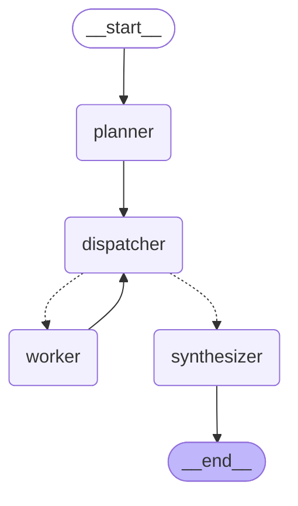

# Architecture


The one-sentence version: **a goal is planned into a task DAG by an LLM that writes
an agent for each task, inside a retrieved menu of YAML-defined capability envelopes
it cannot widen; each agent is created at runtime and granted exactly the MCP tools
its envelope allows; the whole thing streams a trace.**

---

## 1. The idea the design is organised around

A monolithic agent — one big prompt with every tool bolted on — fails in a
specific way: adding a capability means editing a prompt, the tool list grows
until selection degrades, and there is no point at which you can say *why* a
particular tool was used. This project inverts that.

**Agents are created, not configured.** There is no `JiraAgent` class anywhere in
the codebase, and no agent record in YAML either. What
[`backend/config/agents.yaml`](../backend/config/agents.yaml) holds is a
*capability envelope* — permissions and policy, with no prompt:

```yaml
- id: jira_reporting
  description: >-
    Retrieves and summarizes historical Jira sprint records: committed versus
    completed story points, and the velocity trends that follow from them.
  allowed_tool_selectors: ["jira.get_sprints", "jira.get_sprint_issues"]
  allowed_models: ["claude-sonnet-5", "claude-haiku-4-5"]
  default_model: claude-sonnet-5
  max_iterations_limit: 8
  requires_approval: false
  policy: |
    Never estimate, invent or recall a figure you did not retrieve in this task.
```

The agent itself is written by the planner, per task, at request time:

```json
{ "name": "velocity_forecaster",
  "role": "Projects next-sprint velocity from completed points",
  "system_prompt": "Work from actual Jira data, never from assumed numbers.\n\nMethod:\n1. Call jira.get_sprints …",
  "tool_selectors": ["jira.get_sprints", "jira.get_sprint_issues"],
  "max_iterations": 5 }
```

`app/agents/composer.py` decides whether that agent is allowed to exist, and
`app/agents/factory.py` turns the approved spec plus its tools into a coroutine.

Two properties follow, and they are the ones to defend in review:

- **No agent's prompt is a fixed string in this repository.** A `system_prompt`
  key in `agents.yaml` is rejected at startup — there is a test for it.
- **The set of possible agents is unbounded, not four.** One envelope produces
  agents that look nothing like each other; in `tests/test_end_to_end.py` the same
  `jira_reporting` envelope yields one agent with two tools and another with none.

Adding a *capability* is an edit to `agents.yaml`; adding an integration is an
edit to `mcp_servers.yaml`. Neither needs Python.

---

## 2. Agent architecture and routing strategy

### Why a planner rather than a router

A classifier that maps a goal to one agent cannot express *"fetch the history,
then forecast and check capacity from it in parallel, then review the result."*
That is a DAG, not a label. So the routing decision produces a plan.

### The routing pipeline

1. **Embed the goal.** `app/embeddings.py`.
2. **Retrieve a menu.** Top-k capabilities ranked by cosine similarity between the
   goal and each envelope's `description`, top-k tools by their MCP-advertised
   description, and the top-k most similar *completed* past runs from pgvector.
   The menu shows each envelope's tools **resolved to concrete names**, because
   resolved names are what the planner's request will be checked against — showing
   it globs would invite a subset it cannot actually have.
3. **One structured-output call.** The planner LLM returns a `TaskPlan`: a list of
   `{task_id, capability_id, agent, objective, depends_on[]}`, where `agent` is a
   complete agent it designed for that task.
4. **Validate in two layers.** `validate_plan` in `app/graph/state.py` rejects an
   unknown `capability_id`, a dangling or self dependency, a duplicate task id, and
   any dependency cycle. Then `check_envelopes` dry-runs every synthesized agent
   through `realize_agent`, rejecting any that reaches outside its envelope.
5. **On rejection, retry exactly once**, feeding the error back into the
   conversation so the model can see which id it invented or which tool it was
   refused. A second failure fails the run loudly.

The rule that keeps this honest: **the planner designs inside a menu it cannot
widen.** It writes the agent, but a capability id that is not in the registry, and
a tool outside the envelope, both stop at validation. Tested in
`tests/test_planner.py` and `tests/test_composer.py`.

Validating at *planning* time rather than at execution is a deliberate choice: an
escalation then costs one retry instead of a run that dies halfway through having
already spent money on earlier tasks.

### Execution: layered fan-out

The compiled graph has **four nodes regardless of how many agents run**:

```
START → planner → dispatcher ⇄ worker(s) → synthesizer → END
```

`dispatcher` is the scheduler. After the planner and after *every* worker
superstep, `route_ready_tasks` recomputes the set of tasks whose dependencies are
all satisfied and returns one LangGraph `Send` per task. Independent tasks
therefore fan out concurrently, and when nothing is left it routes to the
synthesizer instead.

The consequence worth stating out loud: **parallelism is a property of the plan,
not of the graph topology.** A plan with four independent tasks runs four workers
in one superstep without any change to the graph.

### Tool permissions: the envelope

This is the part that makes runtime agent creation safe rather than reckless.

`tool_selectors` are fnmatch globs over namespaced `<server>.<tool>` names.
An envelope's `allowed_tool_selectors` is a **ceiling**; a synthesized agent's
`tool_selectors` is a **request**. `realize_agent` resolves both through
`ToolRegistry.select` and grants the request only if it is a subset:

```python
escalation = requested - permitted        # both are sets of resolved tool names
if escalation:
    raise EnvelopeViolationError(...)
```

**The comparison is on resolved names, never on the glob strings.** That is the
whole trick. A synthesized selector of `jira.*` is not textually a subset of an
envelope's `jira.get_*`, but resolving both and comparing names is exact. A
string-prefix check here would be the bug that lets a generated agent award
itself the write tool — `tests/test_composer.py` has that exact case.

Three things are taken from the envelope and never from the agent:
`requires_approval` (so a generated agent cannot approve itself), the model
allowlist, and the iteration ceiling. The `policy` text is appended *after* the
generated prompt under an explicit override header, because later instructions
carry more weight — a policy placed first can be talked over by whatever the
planner wrote.

The check runs twice: once at planning time so a violation is retryable, and again
in the worker, because the worker should not trust a plan payload it was handed.

An empty allowance means no tools — deliberately different from meaning all of
them. It is why an `analysis_only` agent physically cannot call Jira, and why a
`jira_reporting` agent physically cannot reach the write tool, however it is
prompted and whatever it names itself.

---

## 3. LangGraph and LangChain — what each is actually used for

| Library | Used for | Not used for |
|---|---|---|
| **LangGraph** | The graph runtime: `Send` fan-out, the Postgres checkpointer, and `interrupt()` for human approval | Anything prebuilt. `create_react_agent` is deliberately not used |
| **LangChain** | Two narrow things: `langchain-mcp-adapters` to turn MCP tools into bindable tools, and `ChatAnthropic` as the model client | Chains, agents, memory, retrievers |

### The compiled graph

The entire topology, which never changes no matter what the planner decides:



Two details are worth reading off it. The dotted edges out of `dispatcher` are the
**conditional** ones — that single decision point is the scheduler, and it is what
turns a plan of any shape into the right number of parallel workers. And
`worker → dispatcher` is a real cycle: every finished task sends control back to be
re-evaluated. Six nodes on the page, any number of agents at runtime.

Three LangGraph features carry real weight and are the reason it was chosen over
hand-rolling an executor:

- **`Send`** gives dynamic map-reduce fan-out. Without it, a runtime-decided
  number of parallel branches means writing a scheduler.
- **`interrupt()` + checkpointer** makes human approval *durable*. The run pauses
  in Postgres, not in memory, so the process can restart and the run is still
  resumable. This is the difference between an approval gate and a modal dialog.
- **Reducers on state** make concurrent worker writes safe by construction.

**The worker's tool loop is hand-written** (`app/agents/factory.py`) rather than
delegated to a prebuilt ReAct agent, for three reasons: `max_iterations` is
enforced per agent spec, every tool call emits `tool.called`/`tool.result` for the
trace, and token usage is attributed per call. A prebuilt agent hides all three
inside a subgraph.

### LangFlow: considered and rejected

LangFlow's flow definition lives in GUI state. This project's entire premise is
that routing is defined by version-controlled configuration and decided at
runtime by a planner. A GUI-authored static flow contradicts both halves. It
would also make the "add an agent without writing code" property *worse*, not
better — a YAML diff reviews; a serialized canvas does not.

### Redis: considered and rejected

The event bus is in-process. A single API process has one publisher and a handful
of SSE subscribers, so there is nothing for a broker to do. Adding Redis would
put a box on this diagram that nothing justifies. The cost is stated plainly in
the limitations: the live bus does not fan out across replicas. The durable copy
of every trace is in Postgres, which is what makes that acceptable.

---

## 4. MCP integration

**Discovery is at startup, and schemas are never hardcoded.** `McpManager` reads
`mcp_servers.yaml`, opens a session per server, and calls `list_tools()`. Whatever
comes back *is* the platform's tool surface. `GET /tools` returns exactly that,
which is the evidence.

### Sessions are held open, each inside its own task

This is the one genuinely subtle piece of the backend and it is worth being able
to explain. A stdio MCP server is a subprocess; reconnecting per tool call would
pay process-spawn cost on every use. But the MCP stdio client is built on anyio
task groups, and **an anyio cancel scope must be exited by the task that entered
it** — while a web server runs lifespan startup and lifespan shutdown in
*different* tasks. Opening the session at startup and closing it at shutdown
therefore fails with `attempted to exit cancel scope in a different task`.

The fix is to give each session a dedicated task that opens it, publishes its
tools, waits on a stop event, and closes it — both ends in one task.

### Policy

`call_tool_with_policy` applies a configurable timeout and bounded retries with
exponential backoff. Retries are for *transport* failures and timeouts only. A
tool that returns an error result has answered the question, so retrying it just
spends the same money for the same answer; the result goes back to the agent,
which decides what to do about it.

Failure is graded, not binary:

| Failure | Consequence |
|---|---|
| A server won't start | Reported; its tools are absent; the rest of the platform runs |
| A tool call exhausts retries | Returned to the model as an error `ToolMessage`; the agent can recover |
| An agent exceeds `max_iterations` | Task marked `failed`; siblings keep their work; the synthesizer reports the gap |
| The planner can't produce a valid plan | The run fails loudly — there is nothing to degrade to |

### Swapping the mock for real Jira

`mcp_servers/jira_mock/` exists because the assignment has no Jira credentials.
Replacing it is a config edit — the commented block in `mcp_servers.yaml` shows
the shape. No application code refers to Jira by name.

---

## 5. Memory design and persistence

One Postgres instance, three tiers with genuinely different jobs.

| Tier | Store | Written | Read | Job |
|---|---|---|---|---|
| **Working** | LangGraph Postgres checkpointer (`thread_id = run_id`) | Every superstep | On resume | Resume a run paused at an approval, across a restart |
| **Episodic** | `runs` + `steps` tables | As each event is published | `GET /runs/{id}` | Trace replay and cost history after the in-process bus has forgotten |
| **Semantic** | `goal_embedding vector(384)` on `runs` | At run start | At plan time | Inject similar completed runs into the planner prompt |

Every event goes to **both** the SSE bus and the `steps` table in the same call
(`build_event_recorder`). A trace that exists in one but not the other is worse
than having neither.

### The embedding model, stated honestly

`app/embeddings.py` uses **OpenAI `text-embedding-3-small`**, with a local lexical
vectorizer as a fallback when no key is configured. Three things about that are
worth defending.

**Why a hosted model at all.** The original implementation was a signed hashing
vectorizer. Signed hashing is mathematically sound — the ± sign makes the inner
product unbiased — but it was badly undersized here: the capability descriptions
produce ~275 features into 384 buckets, of which **23–29% collide**, leaving an
error of ±0.03–0.08 on similarities of only 0.05–0.25. Measured against exact
unhashed cosine over the same features it put the **wrong capability first on
four goals out of five**, including the flagship velocity goal. Raising the
dimension does not rescue it: at 4096 it still recovered only 3/5. The deeper
problem is that it compares spelling, not meaning.

**Why 384 dimensions.** The model is natively 1536, but the v3 models accept a
`dimensions` parameter. Requesting 384 keeps stored vectors the same width as the
existing `Vector(384)` column, so the swap needed **no schema change and no
migration**. One wrinkle worth knowing: OpenAI normalizes the *full-width* vector,
so a truncated one is no longer unit length, and `cosine_similarity` is a bare dot
product. `app/embeddings.py` re-normalizes; without that it would silently rank by
magnitude as well as direction.

**Why the fallback is not decoration.** Both registries embed their descriptions
when they are constructed, and the test fixtures construct them — so without a
working offline path the whole suite would make live API calls on every run. The
fallback keeps tests hermetic and offline development possible, at a measured
cost: on reworded queries, top-1 retrieval is **5/6 hosted against 3/6 lexical**.

Anthropic has no embeddings API, so semantic retrieval necessarily means a second
provider.

One consequence is worth internalising because it is a real lesson of the design:
**a capability's `description` is retrieval surface, not documentation.** An early
version of the forecasting envelope ranked fourth for a velocity goal because its
text never used the word "velocity". Fixing the *config* fixed the routing.

---

## 6. Cost tracking

Every LLM response's `usage_metadata` is priced against a table of per-MTok rates
in `app/costs.py` and accumulated in graph state as one record per call, tagged
with the task and agent that spent it. An unpriced model is recorded in
`unpriced_models` rather than silently costed at zero. Per-run totals land on the
`runs` row and in the `run.completed` event.

---

## 7. The event contract

Seven names, fixed, and nothing else:

```
run.started   task.started   tool.called   tool.result
approval.required   run.completed   run.failed
```

**There is deliberately no `task.completed`.** The frontend therefore *derives*
per-task completion (`frontend/src/hooks/runState.js`): a task is done when a
task that depends on it starts — which is sound because the dispatcher only
releases a task once all its dependencies have returned — or when `run.completed`
arrives carrying each task's final status.

This is a real trade-off and worth naming: it keeps the wire contract minimal and
the client slightly cleverer. An eighth event name would make the client dumber.
If this contract were reopened, `task.completed` is the change I would argue for.

---

## 8. Notable decisions

**Failure inside a run is graded rather than fatal.** A worker that fails records
a failed task; siblings keep their work and the synthesizer is instructed to
report what is missing rather than paper over it. A partial answer that says what
it is missing beats a 500.

**Approval interrupts are detected in the orchestrator, not the worker.** A node
that emitted its own `approval.required` would emit it a second time, because
LangGraph replays the node when the graph resumes.

**The synthesizer has no tools, by design.** It can only use figures the workers
retrieved, and is instructed to say when something was not retrieved. Giving it
tools would let it quietly paper over a failed task.

**Modules that aren't in the assignment's suggested layout.** Four small ones
were added rather than growing others past the ~200-line limit:
`embeddings.py`, `costs.py`, `chat_models.py` (a single-seam model constructor),
and `orchestrator.py` (the run driver, which is genuinely its own job and would
otherwise bloat the route handlers).

---

## 9. What I would change for production

| Area | Now | Production |
|---|---|---|
| Embeddings | `text-embedding-3-small` at 384 dims, lexical fallback | Drop the fallback, embed asynchronously, and re-embed stored runs on a model change |
| Event bus | In-process | Postgres `LISTEN/NOTIFY` before reaching for a broker |
| Schema | `create_all` at boot | Alembic migrations |
| Auth | None | Per-tenant auth; MCP credentials scoped per user, not per process |
| Planner quality | Untested | A labelled goal→plan eval set, scored on agent selection |
| Approval | Any caller can approve | Approver identity recorded and authorised |
| Forecasting | Rolling average | An actual model — and the honest note that the rolling average is a baseline, not a forecast |
